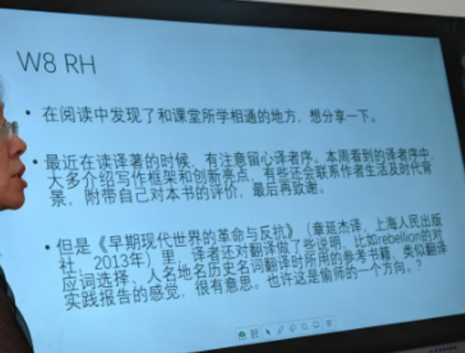

# 第八周课堂笔记

勤奋的同学233, 翻译要注意时代背景

章延杰, 68年生, 复旦大学法学博士

MTI 也和自己的专业方向有很大关系.

**rebelion** 反抗, 暴动, 叛乱, 谋反

拒绝 A ---> B 的翻译思维模式, 应该是 A ---> B1 ... Bn 

注意第三部分, 专业译者也有类似于翻译报告的东西, 需要借鉴.

---

## 上周作业评价

- 袁雅宁同学 报告

  "一些结构复杂的长句也基本可以在保证意义逻辑完整地情况下, 用尽量简洁的译文传达"

  "准确大于通顺"

  "evolve" 不断演变的, 我翻译的是 "蓬勃发展的"

  我自己 `as required` 部分翻译有误  Enhanced elasticity of storage/processing capacity as required by demand

  "some predict that" 据预测, 有人认为

  **老师的意见 通用英语 到 专业, 跨度较大. 所以思维也要变化** 

  老师, 译校审

  bail out 美国经济危机, 政府的做法搭救金融机构

- 翟若卿同学 缩略语表
  
  术语表其实可以自己制作, 根据自己的需求做